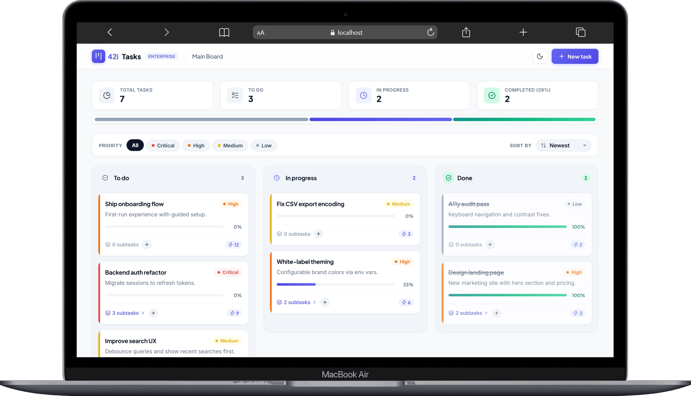
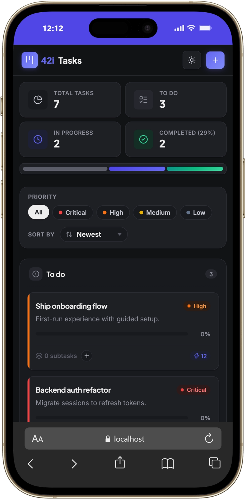
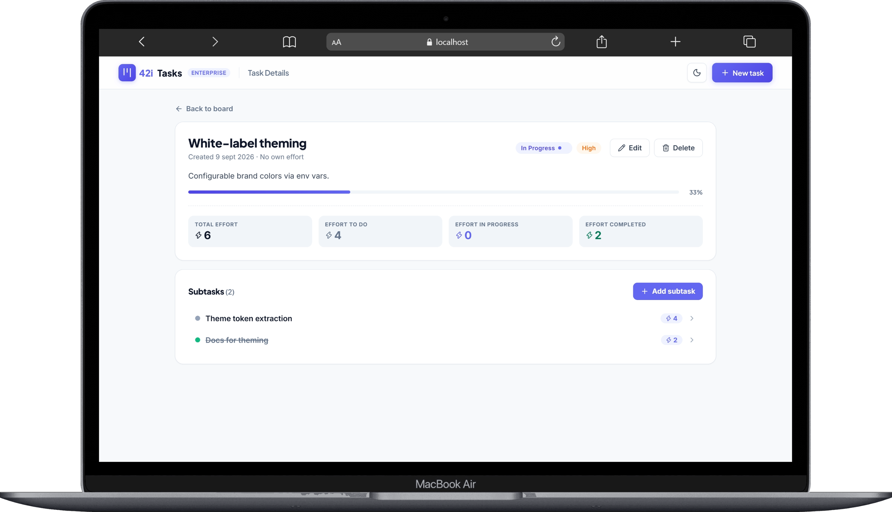
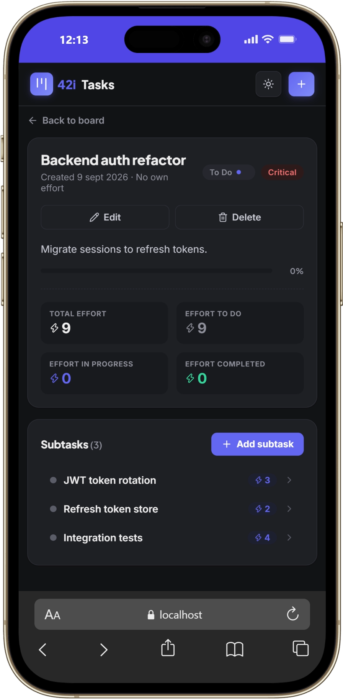

# ToDoApp 42i

Task manager for a small development team: plan, organize, prioritize and
estimate work with unlimited subtask hierarchies, automatic lifecycle tracking
and workload overview.

| Package      | Stack                                          |
| ------------ | ---------------------------------------------- |
| `backend/`   | Node.js · Express 5 · TypeScript · PostgreSQL  |
| `frontend/`  | React 19 · TypeScript · Vite · nginx           |

## Screenshots

<table>
  <thead>
    <tr>
      <th></th>
      <th align="center">Desktop · light</th>
      <th align="center">Mobile · dark</th>
    </tr>
  </thead>
  <tbody>
    <tr>
      <td align="center"><strong>Home</strong></td>
      <td align="center"></td>
      <td align="center"></td>
    </tr>
    <tr>
      <td align="center"><strong>Detail</strong></td>
      <td align="center"></td>
      <td align="center"></td>
    </tr>
  </tbody>
</table>

## Requirements

- **Docker Desktop** (recommended path — runs everything with one command).
- Or, for local development: **Node.js 22+** and a local **PostgreSQL**.

## Quick start with Docker Compose

Get the code:

```bash
git clone https://github.com/manuelahenaod/ToDoApp-42i.git
cd ToDoApp-42i
```

The whole stack — database, API and web app — runs with a single command from
the repository root:

```bash
docker compose up --build
```

What happens, step by step:

1. `db`: starts PostgreSQL 16 with a persistent volume and a healthcheck.
2. `backend`: builds the API image, waits for `db` healthy, and on boot
   **auto-applies the database schema** (idempotent migration).
3. `frontend`: builds the web app and serves it with nginx, proxying `/api` to
   the backend.

Open:

- Web app: <http://localhost:8080>
- API: verify it is healthy at <http://localhost:3001/health> (returns a JSON
  response). The API endpoints live under `/api` and return JSON; see the
  [API](#api) section.

Stop the stack:

```bash
docker compose down
```

Reset the database too (deletes the volume):

```bash
docker compose down -v
```

Run in the background and follow logs:

```bash
docker compose up -d
docker compose logs -f backend
```

## Local development

Requires Node.js 22+ and a running PostgreSQL. Run the commands below from the
repository root. To use Docker just for the database, start `db` alone with
`docker compose up -d db`.

### 1. Backend

```bash
cd backend
cp .env.example .env   # adjust DB credentials if needed
npm install
npm run dev            # http://localhost:3001
```

> On Windows PowerShell use `copy .env.example .env` instead of `cp`.

The schema is applied automatically on boot (`npm run dev` runs the idempotent
migration).

### 2. Frontend

In a second terminal:

```bash
cd frontend
npm install
npm run dev            # http://localhost:5173
```

Vite proxies `/api` to <http://localhost:3001>.

### 3. Backend production build (no Docker)

```bash
cd backend
npm run build          # compiles to dist/
npm start              # runs dist/index.js on http://localhost:3001
```

## Tests

Unit tests run with Vitest (no database or network needed):

```bash
cd backend && npm test     # vitest run — 59 tests
cd frontend && npm test    # vitest run — 19 tests
```

Coverage: backend business logic (validation, derived statuses in multi-level
trees, cycle prevention, effort rollup, list filter/sort/pagination) and
frontend logic (API client, progress bar, labels/helpers).

Type-check, lint and build the frontend:

```bash
cd frontend && npm run build
cd frontend && npm run lint
```

## Key technical decisions

- **Status derived from subtasks**: when a task has subtasks, its status is
  computed from them (single source of truth), so the board never contradicts a
  task with its children.
- **Effort counts leaves only**: `effort_estimate` lives on tasks without
  subtasks; parents show the rolled-up `total_effort` — no double counting.
- **Cycle prevention**: a task can never be its own descendant; cyclic
  `parent_id` updates are rejected.
- **Layered backend**: routes → controllers → services → repositories, with
  business rules in the service layer (unit-tested).
- **Schema on boot**: the backend applies an idempotent migration on startup;
  the Dockerfile copies `schema.sql` into `dist/` because `tsc` does not copy
  non-TS files.

## API

All endpoints are under the `/api` prefix and return JSON. Example with the
full path:

```bash
GET http://localhost:8080/api/tasks      # via nginx
GET http://localhost:3001/api/tasks      # dev, straight to the backend
```

Opening a base path such as `/api` in the browser returns a JSON `404` because
there is no resource at the root — always use the full endpoint path.

| Method   | Endpoint                  | Description                                              |
| -------- | ------------------------- | -------------------------------------------------------- |
| `GET`    | `/api/tasks`              | List tasks. Query params: `status`, `priority`, `page`, `limit`, `sort`, `order` |
| `POST`   | `/api/tasks`              | Create task (`title` required, `status`, `description`, `priority`, `effort_estimate`, `parent_id`) |
| `GET`    | `/api/tasks/:id`          | Task detail with subtree, effort stats and breadcrumb    |
| `PUT`    | `/api/tasks/:id`          | Update task fields                                       |
| `DELETE` | `/api/tasks/:id`          | Delete task (subtasks cascade)                           |
| `POST`   | `/api/tasks/:id/subtasks` | Create a subtask                                         |
| `GET`    | `/api/stats`              | Global counts by status                                  |

Example:

```bash
curl -X POST http://localhost:8080/api/tasks \
  -H "Content-Type: application/json" \
  -d '{"title":"Build login endpoint","priority":"high","effort_estimate":5}'
```

## Repo layout

```
.
├── backend/            # Express 5 + TypeScript + PostgreSQL
│   ├── src/
│   │   ├── routes/      # HTTP routes
│   │   ├── controllers/ # Request parsing/HTTP concerns
│   │   ├── services/    # Business logic
│   │   ├── repositories/ # SQL queries
│   │   └── db/          # pool + idempotent schema migration
│   └── tests/          # 59 unit tests
├── frontend/           # React 19 + Vite
│   └── src/
│       ├── features/tasks  # components, hooks, types, api, utils
│       ├── shared/         # reusable UI + api client
│       └── pages/          # route-level pages
├── docs/screenshots/   # project screenshots
└── docker-compose.yml  # single-command stack (db + api + web)
```

## AI usage

This project was developed with [opencode](https://opencode.ai), using the
`opencode/big-pickle` model in a paired workflow. [`AGENTS.md`](./AGENTS.md)
contains the instructions and key technical decisions the agent was given and
followed during development; the agent config lives in
`.opencode/opencode.json`. All code went through human review and automated
tests before every commit.

---

Developed by Manuela Henao Duque for 42i.